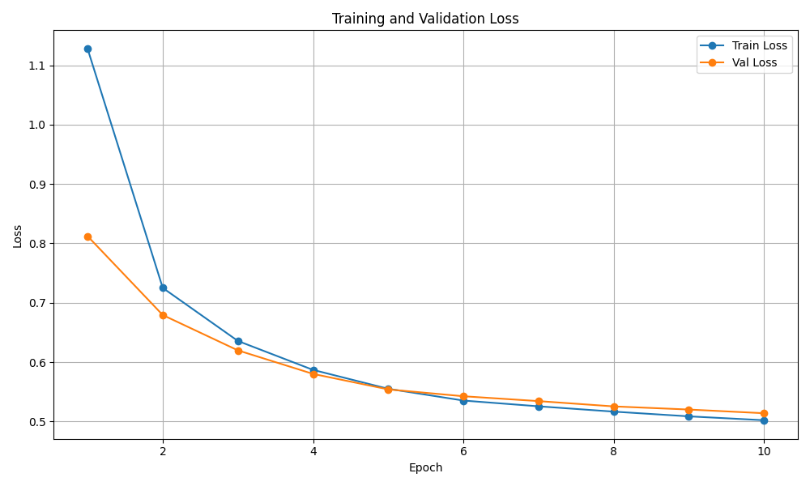
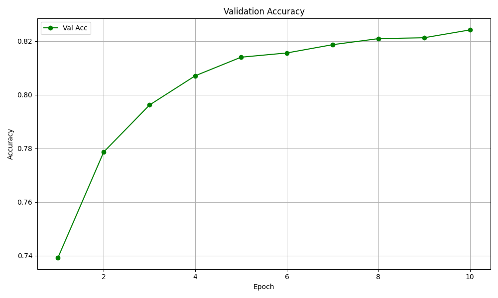
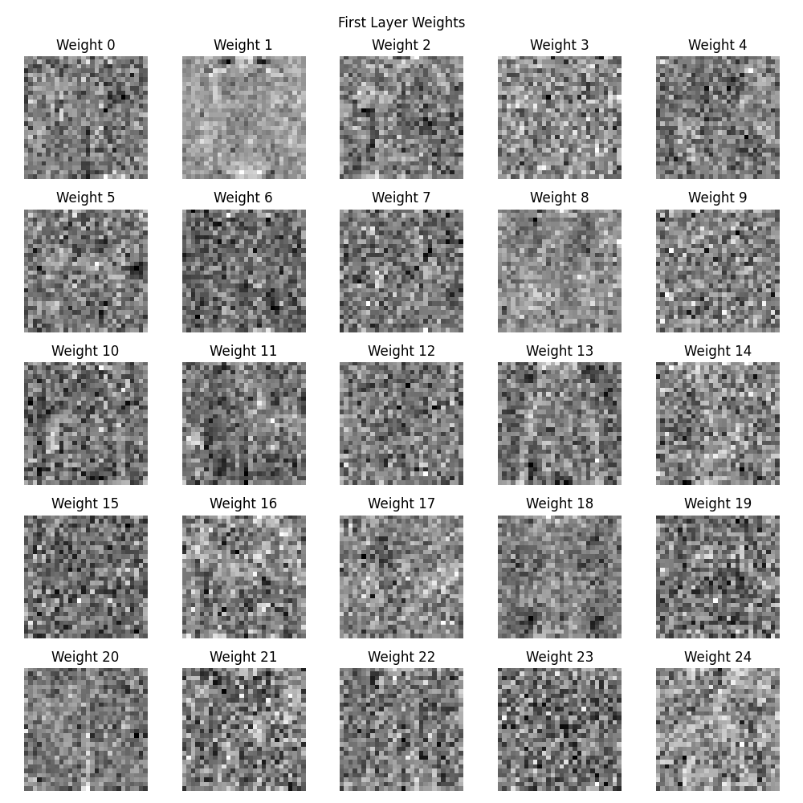
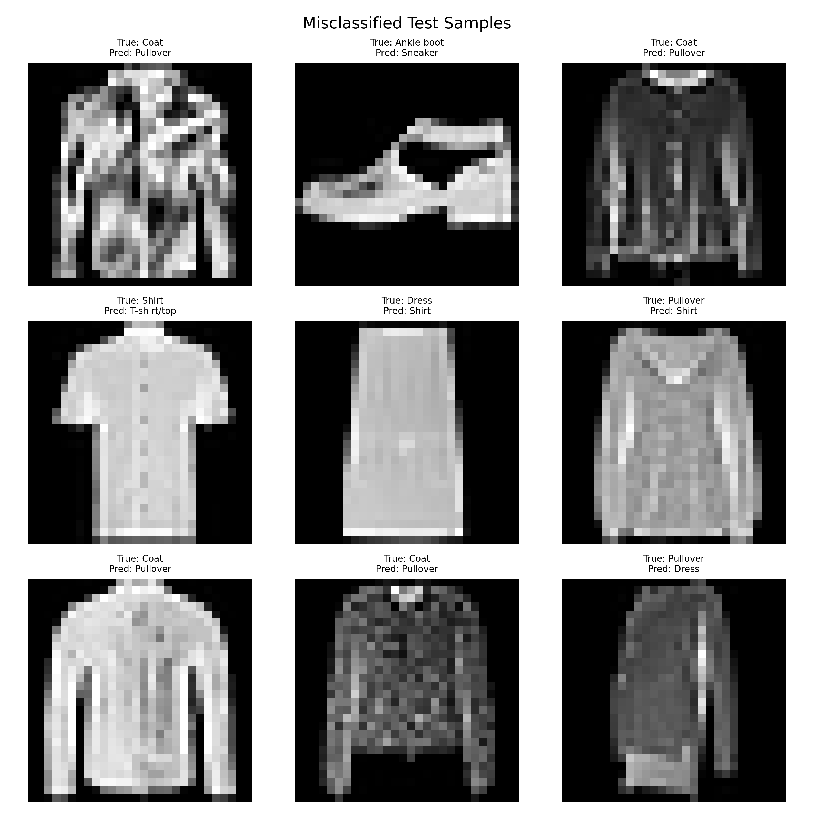

# HW1 实验报告：从零实现三层 MLP 完成 Fashion-MNIST 图像分类

## 1. 实验目的

从零实现一个三层多层感知机（MLP）分类器，在 Fashion-MNIST 数据集上完成 10 类服饰图像分类任务。按照作业要求，实验中不使用 PyTorch、TensorFlow、JAX 等自动微分框架，而是基于 NumPy 手动实现前向传播、反向传播、损失函数与参数更新过程。


## 2. 数据集与任务说明

本实验使用的数据集为 Fashion-MNIST。该数据集包含 10 个类别的灰度服饰图像，每张图像大小为 28×28。图像类别如下：

1. T-shirt/top
2. Trouser
3. Pullover
4. Dress
5. Coat
6. Sandal
7. Shirt
8. Sneaker
9. Bag
10. Ankle boot

在代码实现中，输入图像被展开为长度为 784 的一维向量，作为 MLP 的输入。

## 3. 模型设计与实现

本实验实现的是一个三层 MLP，结构如下：

- 输入层维度：784
- 隐藏层维度：可调
- 输出层维度：10

模型主要由以下部分组成：

- `Linear` 层：实现线性变换
- 激活函数层：支持 `ReLU` 和 `Sigmoid`
- `CrossEntropyLoss`：实现交叉熵损失
- `SGD`：实现随机梯度下降优化器

训练过程中使用了以下策略：

- 使用验证集准确率保存最优模型
- 使用 L2 正则化（Weight Decay）
- 使用学习率衰减（Learning Rate Decay）


## 4. 实验设置

### 4.1 数据处理

- 训练数据从 `train` 集中划分出训练集和验证集
- 验证集比例：`0.2`
- 输入图像像素归一化到 `[0, 1]`

### 4.2 最终采用的训练配置

根据超参数搜索结果，最终选取的训练配置如下：

- `epochs = 10`
- `batch_size = 128`
- `learning_rate = 0.1`
- `weight_decay = 0.0`
- `hidden_dim = 128`
- `activation = ReLU`
- `val_ratio = 0.2`
- `seed = 42`
- `lr_decay_every = 5`
- `lr_decay_gamma = 0.5`

在该配置下，验证集最佳准确率为 `0.8741`
## 5. 训练过程分析

在最终最优配置下，模型训练过程较为稳定，训练损失和验证损失都随着 epoch 增加逐步下降，验证集准确率也持续提升，说明模型能够有效学习到 Fashion-MNIST 中的判别特征。

训练历史如下：

- 初始训练损失：`0.6847`
- 最终训练损失：`0.3346`
- 初始验证损失：`0.6320`
- 最终验证损失：`0.3622`
- 初始验证准确率：`0.7573`
- 最终验证准确率：`0.8741`

### 5.1 Loss 曲线

从 Loss 曲线可以看出，训练集和验证集的损失均随着训练进行而稳定下降，没有出现明显震荡。这说明当前学习率和优化策略是有效的，模型在 10 个 epoch 内已经较好收敛。



### 5.2 Validation Accuracy 曲线

从验证集 Accuracy 曲线可以看到，模型准确率在前几个 epoch 提升较快，在后期逐渐趋于稳定。第 10 个 epoch 达到最佳验证准确率 `0.8741`。



## 6. 超参数搜索结果

对以下超参数进行了网格搜索：

- 学习率：`0.1`、`0.01`、`0.001`
- 隐藏层维度：`64`、`128`、`256`
- 权重衰减：`0`、`0.0001`、`0.001`
- 激活函数：`ReLU`、`Sigmoid`

搜索结果表明：

- `ReLU` 的表现整体明显优于 `Sigmoid`
- 学习率 `0.1` 的效果最好，`0.01` 次之，`0.001` 偏小，模型收敛较慢且性能较差
- 隐藏层维度从 `64` 增加到 `128` 或 `256` 后，验证集准确率有一定提升
- `weight_decay` 对最终性能有一定影响，但不是决定性因素

本次搜索中表现最好的配置之一为：

- `learning_rate = 0.1`
- `hidden_dim = 128`
- `weight_decay = 0.0`
- `activation = ReLU`
- `best_val_acc = 0.8741`

从整体结果来看，本实验中较大的学习率配合 ReLU 激活函数能够更有效地训练该 MLP 模型。

## 7. 测试集结果

在最优模型下，测试集准确率为：

**Test Accuracy = 0.8638**

对应的混淆矩阵如下：

```text
[[854   2  18  51   4   1  53   0  17   0]
 [  2 959   1  27   4   0   5   0   2   0]
 [ 15   2 797  17 109   1  52   0   7   0]
 [ 26  11  13 898  30   1  17   0   4   0]
 [  0   0 107  38 789   1  57   0   8   0]
 [  1   0   0   2   0 944   0  40   2  11]
 [160   1 120  53  85   1 550   0  30   0]
 [  0   0   0   0   0  34   0 942   0  24]
 [  3   1   7   9   5   2   3   5 965   0]
 [  0   0   0   0   0  13   0  46   1 940]]
```

从混淆矩阵可以看出，模型对 `Trouser`、`Bag`、`Sneaker`、`Ankle boot` 等类别的识别效果较好，而在 `Shirt`、`Pullover`、`Coat`、`T-shirt/top` 这些外观相近的上衣类服饰之间更容易发生混淆。

## 8. 权重可视化分析

将第一层隐藏层权重恢复为图像尺寸后，可以观察到部分神经元已经学习到类似边缘检测器和轮廓检测器的模式。一些权重对图像中间区域敏感，另一些更关注服饰外轮廓、袖子和鞋类边缘等局部区域。

这说明虽然 MLP 没有卷积结构，但仍然能够从原始像素中学习到一定程度的低层视觉特征。



## 9. 错误分析

对测试集错误分类样本进行观察后，可以发现模型最容易混淆的类别主要集中在外观相似的服饰之间。例如：

- `Coat` 容易被误分类为 `Pullover`
- `Shirt` 容易被误分类为 `T-shirt/top`
- `Dress` 有时会被误分类为 `Shirt`
- `Ankle boot` 与 `Sneaker` 之间也存在少量混淆

这些错误说明，MLP 直接对展开后的像素向量进行建模时，难以充分利用图像的空间局部结构，因此在区分细粒度、轮廓相似的类别时能力有限。

当前错误分析图中共展示了 9 个错误样本，模型在测试集上一共分类错误 `1362` 张图像。



## 10. 实验结论

本实验基于 NumPy 从零实现了一个三层 MLP，并在 Fashion-MNIST 数据集上完成了训练、测试、超参数搜索、训练过程可视化、权重可视化以及错误分析。

实验结果表明：

1. 使用 `ReLU` 激活函数的模型整体优于 `Sigmoid`
2. 较大的学习率 `0.1` 在本实验中效果最好
3. 增加隐藏层维度可以提升性能，但提升幅度有限
4. 最终模型在测试集上取得了 `0.8638` 的准确率
5. MLP 能学习到一定的边缘和轮廓特征，但对于相似服饰类别仍然容易混淆

总体来看，本实验较好地完成了从零实现神经网络分类器的目标，也加深了我对前向传播、反向传播、损失函数以及优化算法的理解。

## 11. 代码与模型链接

- GitHub Repo：`[请在这里填写你的 GitHub 仓库链接]`
- 模型权重下载链接：`[请在这里填写你的网盘下载链接]`

## 12. 附：项目运行方式

如需复现实验，可以在 `HW1` 目录下运行：

```powershell
python .\mlp\train.py
python .\mlp\test.py
python .\mlp\plot_curves.py
python .\mlp\visualize_weights.py
python .\mlp\error_analysis.py
python .\mlp\search.py
```
